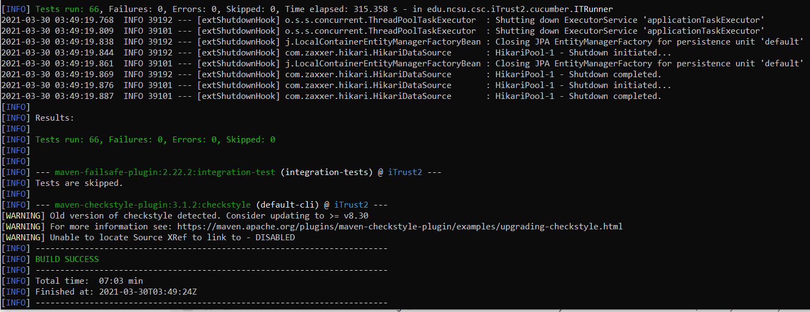

# Milestone-2 Progress

## Current Progress

Checkpoint progress: [Link](https://github.ncsu.edu/cscdevops-spring2021/DEVOPS-16/projects/3)

* [X] Automatically configure a build environment and build job (20%).
* [ ] Test prioritization analysis (30%).
* [ ] Static analysis (30%).
* [X] Checkpoint and milestone report (10%).
* [ ] Screencast (10%).

## Automatically configure a build environment and build job (iTrust)

* [X] Added github developer token and user to jenkins credential manager.
* [X] Installed necessary dependencies like Maven, Mysql etc on VM.
* [X] Started and set root password for Mysql.
* [X] Replaced the file/content iTrust2/src/main/resources/application.yml with the appropriate settings in VM.
* [X] Installed chromedriver and it's necessary dependencies on VM.

## Next Steps

* Create fuzzer with various fuzzing techniques.
* Sort test cases based on number of test cases failed.
* Do various static code analysis.

## Build Pass

## Team contributions

| Task                                          	| Contributors                    	|
|-----------------------------------------------	|---------------------------------	|
| Setting up Maven and MySQL for iTrust2        	| Kenil Shah, Jay Mohta           	|
| Encrypting the user:password for MySQL        	| Shahil Shah                     	|
| Making MySQL setup script Idempotent          	| Jay Mohta                       	|
| Hide the Login Details from application.yml    	| All members contributed equally 	|
| Add Github Credentials to Jenkins             	| Kenil Shah                      	|
| Setting up the Google Chrome and it's driver  	| All members contributed equally 	|
| Creating Build Pipeline for running tests     	| All members contributed equally 	|
| Resolving issues while running build commands 	| All member contributed equally  	|
