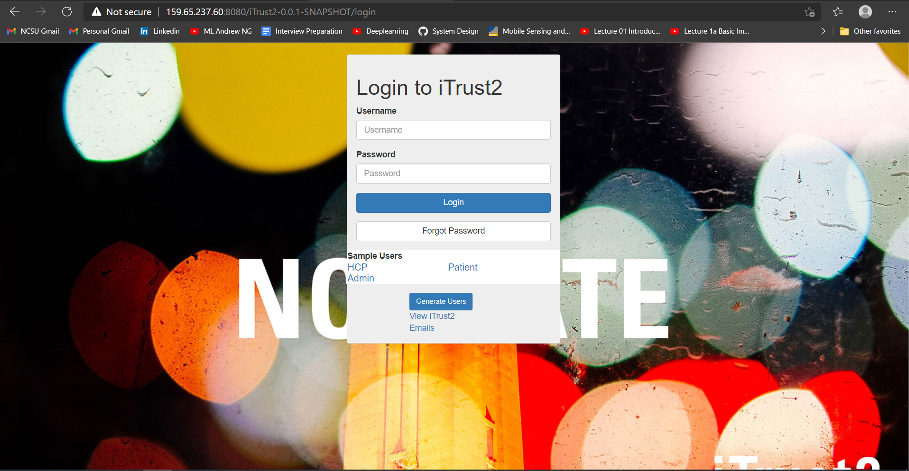

# Milestone-3 Progress

## Current Progress

Checkpoint progress: [Link](https://github.ncsu.edu/cscdevops-spring2021/DEVOPS-16/projects/4)

* [X] Provision instances (20%).
* [X] Implement configuration steps for deployment (20%).
* [ ] Canary analysis (40%).
* [ ] Checkpoint and milestone report (10%).
* [ ] Screencast (10%).
* [ ] Monitoring dashboard (15%).

### Provision Instances
* Made 3 droplets necessary for iTrust, checkbox.io and monitoring.
* Fetched IP address of these droplets and generated an inventory file.

### Implement Configuration Steps for Deployment
* Added Tomcat, Java, Maven and MySql to the Ansible script.
* Sent the .War file to the iTrust droplet necessary for deployment.

## Next Steps
* Finish Up Canary Analysis.
* Adding Configuration Files for checkbox.io
* Implement Monitoring Dashboard.
* Make ScreenCast.

## ScreenShots

### Deployed iTrust Application (Image)

## Team Contribution

|                      Task                      	|              Contributor             	|
|:----------------------------------------------:	|:------------------------------------:	|
|                Implement Prod.js               	|               Jay Mohta              	|
|                Create Var Files                	|              Kenil Shah              	|
|       Add Developer Key in encrypted File      	|              Shahil Shah             	|
|               Create playbook.yml              	|       Shahil Shah and Jay Mohta      	|
| Deploy iTrust Application on production server 	|       Kenil Shah and Jay Mohta       	|
|       Deploy roles for both Applications       	| All team members contributed equally 	|
