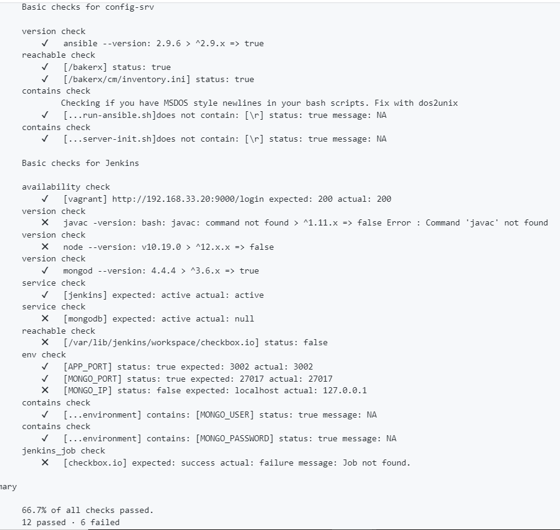

# Milestone - 1 Progress

## Current Progress
Checkpoint-1 Progress: [Link](https://github.ncsu.edu/cscdevops-spring2021/DEVOPS-16/projects/2)
* [X] Automatically configure a jenkins server. (40%)
* [X] Automatically configure a build environment. (20%)
* [ ] Create a build job. (20%)
* [X] Checkpoint and milestone report. (10%)
* [ ] Screencast. (10%)

## Task 1 (Automatically configure a jenkins server)
* [X] Use bakerx as local provisioner for your VM (named "config-srv"). Keep ansible and jenkins on the same VM; Assign static ip address 192.168.33.20 for your VM. [(Code)](https://github.ncsu.edu/cscdevops-spring2021/DEVOPS-16/blob/master/commands/setup.js#L22)
* [X] Run jenkins server on port 9000. [(Code)](https://github.ncsu.edu/cscdevops-spring2021/DEVOPS-16/blob/master/cm/roles/config_jenkins/tasks/main.yml#L2-L6)
* [X] Use admin:admin as username and password for jenkins [(Code)](https://github.ncsu.edu/cscdevops-spring2021/DEVOPS-16/blob/master/cm/roles/config_jenkins/tasks/main.yml#L13-L16)
* [X] Install jenkins-plugins needed to use Pipelines style build jobs. [(Code)](https://github.ncsu.edu/cscdevops-spring2021/DEVOPS-16/blob/master/cm/roles/config_jenkins/tasks/main.yml#L34-L36)

## Task 2 (Automatically configure a build environment (checkbox.io))
* [X] Install mongodb and nodejs. [(Code)](https://github.ncsu.edu/cscdevops-spring2021/DEVOPS-16/blob/master/cm/roles/build_environment/tasks/main.yml)
* [X] Create mongo user with password and readWrite role. [(Code)](https://github.ncsu.edu/cscdevops-spring2021/DEVOPS-16/blob/master/cm/roles/configure_mongodb/tasks/main.yml)
* [X] Define APP_PORT=3002,MONGO_PORT=27017, MONGO_USER=<user> MONGO_PASSWORD=<pass>, and MONGO_IP=localhost. [(Code)](https://github.ncsu.edu/cscdevops-spring2021/DEVOPS-16/blob/master/cm/roles/configure_mongodb/tasks/main.yml)

## Task-3 (Create a build job for jenkins)
Work in progress. We are currently working on how to use jenkins-job builder CLI tool to generate the job and then use build command to access the logs. (Current code can be found [here](https://github.ncsu.edu/cscdevops-spring2021/DEVOPS-16/blob/master/commands/build.js))

## Opunit Test Passed Screenshot

Based on the last opunit check we were passing 12 tests out of 18. We have updated our code such that four more tests should pass. Those tests are javac, node, mongodb and MONGO_IP.

## Team contributions

| Task                                           	| Contributors                    	|
|------------------------------------------------	|---------------------------------	|
| Initial setup of the project from template     	| Kenil Shah, Jay Mohta           	|
| Setup role in cm                               	| All members contributed equally 	|
| Config Jenkins role in cm                      	| Kenil Shah, Jay Mohta           	|
| Structuring the repo                           	| All members contributed equally 	|
| Configure MongoDB role in cm                   	| Jay Mohta, Shahil Shah          	|
| Build Environment role in cm                   	| Jay Mohta, Kenil Shah           	|
| Resolving node version error in opunit         	| Shahil Shah                     	|
| Resolving error for jenkins jobs no connection 	| Jay Mohta, Shahil Shah          	|
